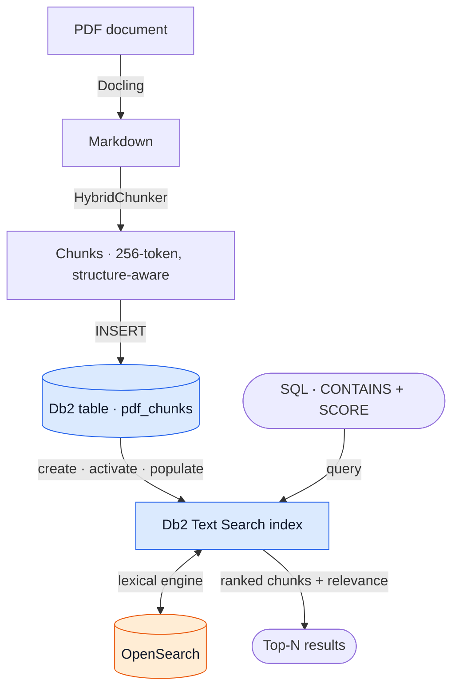

# LinkedIn assets — hybrid search workflow

**Post image:** `linkedin_workflow.png` (1080×1350, 4:5 portrait — the size LinkedIn
favors in-feed on mobile). Regenerate or tweak it with `make_linkedin_graphic.py`.

---

## Suggested caption

> **Everyone demos vector search. Almost no one ships the *other* half of hybrid search.**
>
> Most "AI search" walkthroughs jump straight to embeddings. But production retrieval is **hybrid** — lexical (keywords) *and* semantic (vectors), fused into one ranking. I'm building it end-to-end, and Part 1 is the lexical leg, working on a real PDF:
>
> 📄 PDF → 📝 Markdown (Docling) → 📦 chunks (HybridChunker) → 🗄️ Db2 → 🔎 Db2 Text Search → ranked results
>
> The part that surprises engineers: **search is just SQL.** `CONTAINS` + `SCORE`, and Db2 drives OpenSearch under the hood — no separate search service to wire up or keep in sync.
>
> Next up: embeddings → vector search → RRF fusion = hybrid search.
>
> Building this in the open — follow along if you're leveling up from "I use AI APIs" to "I design AI retrieval systems."
>
> #HybridSearch #RAG #VectorSearch #Db2 #OpenSearch #AIEngineering #SearchInfrastructure #MachineLearning

---

## Editable diagram (Mermaid)

Paste into <https://mermaid.live> to render/export, or keep the PNG as-is.

## Posting tips
- Lead with the hook line; LinkedIn truncates after ~3 lines, so the first sentence must earn the "…see more" click.
- Upload the PNG as a **document/image**, not a link, so it renders large in-feed.
- 3–5 focused hashtags outperform a long list; trim the set above if needed.
