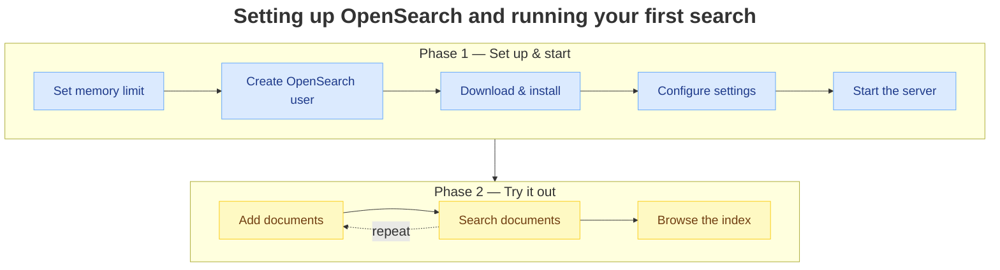

# Installing OpenSearch on Red Hat Linux 10

A beginner-friendly guide to running OpenSearch on your own computer. Copy and
paste each block in order — the whole setup takes about 10 minutes. By the end
you'll have OpenSearch running locally and will have added and searched your
first documents.

> [!WARNING]
> This setup turns off OpenSearch's passwords and security to keep things simple.
> Use it only on your own computer — never on one others can reach over a network.

## Before you start

You'll need:

- A computer running Red Hat Linux 10, with permission to install software
  (some commands use `sudo` and may ask for your password).
- About 2 GB of free memory and 1 GB of free disk space.
- An internet connection, plus `curl` (preinstalled on Red Hat Linux 10).

OpenSearch bundles everything else it needs, including Java.

## Overview

Open a terminal and run each block below in order.



## Step 1 — Increase the memory limit

OpenSearch keeps a large number of files open at once — more than the Linux
default of about 65,530. Raise the limit to 262,144 once, or OpenSearch won't
start:

```bash
echo 'vm.max_map_count=262144' | sudo tee /etc/sysctl.d/99-opensearch.conf
sudo sysctl -p /etc/sysctl.d/99-opensearch.conf
```

Check it with `sysctl vm.max_map_count` — it should print `262144`.

## Step 2 — Create an account to run OpenSearch

OpenSearch won't run under your main account, so create a separate one for it:

```bash
sudo useradd --system --no-create-home --shell /sbin/nologin opensearch
```

## Step 3 — Download and unpack OpenSearch

Download OpenSearch into `/opt/opensearch` and give the new account ownership:

```bash
cd /opt
sudo wget https://artifacts.opensearch.org/releases/bundle/opensearch/3.7.0/opensearch-3.7.0-linux-x64.tar.gz
sudo tar -xzf opensearch-3.7.0-linux-x64.tar.gz
sudo mv opensearch-3.7.0 opensearch
sudo rm opensearch-3.7.0-linux-x64.tar.gz
sudo chown -R opensearch:opensearch /opt/opensearch
```

## Step 4 — Configure OpenSearch

Open the settings file:

```bash
sudo -u opensearch vi /opt/opensearch/config/opensearch.yml
```

Add these lines — they name the setup, run it as a single server, and turn off
security for local testing:

```yaml
cluster.name: db2-text-search-cluster
node.name: node-1
network.host: 0.0.0.0
http.port: 9200
discovery.type: single-node
plugins.security.disabled: true
```

> **Using `vi`?** Press `i` to type, paste the lines, then `Esc` and `:wq` to save.

## Step 5 — Start OpenSearch

Start it in the background (it keeps running after you close the terminal):

```bash
sudo -u opensearch /opt/opensearch/bin/opensearch -d -p /opt/opensearch/opensearch.pid
```

It takes about a minute to be ready the first time.

## Step 6 — Check it's working

```bash
curl "http://localhost:9200"
```

You should get a JSON response showing your `node-1` and
`db2-text-search-cluster` names — that means OpenSearch is running. 🎉

## Try it out — add and search documents

- A **document** is one record (like a row), written as JSON.
- An **index** is the collection of documents (like a table). OpenSearch creates
  it automatically when you add the first document.

### Add documents

Add two documents to an index called `articles`. Posting to `_doc` with no ID
lets OpenSearch assign one automatically:

```bash
curl -X POST "http://localhost:9200/articles/_doc" \
  -H 'Content-Type: application/json' \
  -d '{
    "title": "How a computer stores the letter A",
    "body":  "A computer does not know what the letter A is. It only stores numbers. When you press A, the system translates it to the number 65 and stores 65.",
    "tags":  ["encoding", "bytes"]
  }'

curl -X POST "http://localhost:9200/articles/_doc" \
  -H 'Content-Type: application/json' \
  -d '{
    "title": "Bytes, bits, and ASCII",
    "body":  "A byte is 8 bits, and a bit is a 0 or a 1. Eight bits give 256 possible values, from 0 to 255. ASCII defines 128 characters: English letters, digits, and punctuation.",
    "tags":  ["encoding", "ascii"]
  }'
```

A response with `"result": "created"` confirms each was stored.

### Search

**Full-text search** (`match`) — for free text like a title or body;
case-insensitive, matches words anywhere:

```bash
curl -X GET "http://localhost:9200/articles/_search?pretty" \
  -H 'Content-Type: application/json' \
  -d '{ "query": { "match": { "body": "byte" } } }'
```

**Exact-match search** (`term`) — for exact values like tags or IDs. Wrapping it
in a `filter` skips relevance ranking, which is faster:

```bash
curl -X GET "http://localhost:9200/articles/_search?pretty" \
  -H 'Content-Type: application/json' \
  -d '{ "query": { "bool": { "filter": { "term": { "tags": "ascii" } } } } }'
```

In the results, `hits.total.value` is the match count and each
`hits.hits[]._source` is a matching document.

### See everything in the index

```bash
curl "http://localhost:9200/articles/_search?pretty"
```

### Clean up

Delete the whole index when you're done:

```bash
curl -X DELETE "http://localhost:9200/articles"
```

## Starting and stopping

Stop OpenSearch:

```bash
sudo kill "$(cat /opt/opensearch/opensearch.pid)"
```

To start it again later, rerun the command from Step 5 — no need to reinstall.
